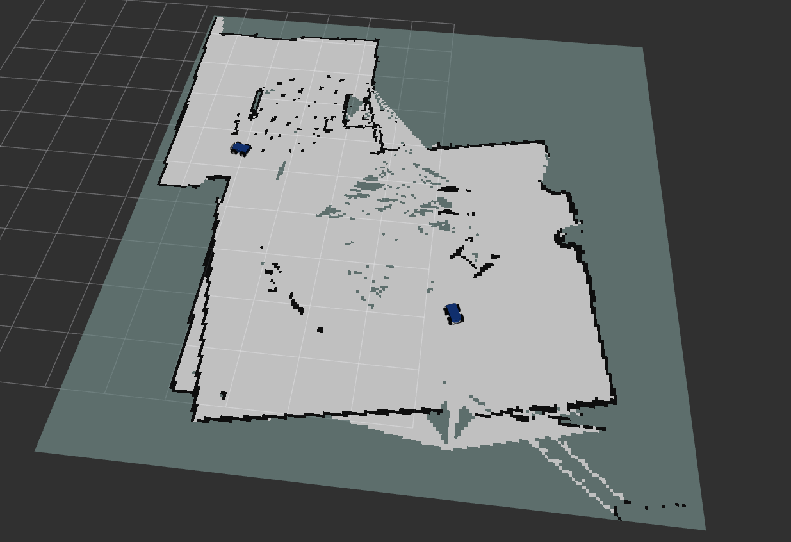

# Gazebo-ROS2 Demo

I used the X1 car model and the harmonic world from gazebo fuel:
https://app.gazebosim.org/fuel/models

<div style="display: flex; gap: 10px;">
  
  
</div>




## Installation Guide
I reinstalled with a clean install of Ubuntu 24.04, and created these minimal steps below. This installation should be sufficient to run the code in this repo.

### 1. Recommended Environment
I used the following combination as is recommend on gazebo website:

* **ROS 2:** Jazzy
* **Gazebo:** Harmonic (LTS)
* **OS:** Ubuntu 24.04

---

### 1.1 Recommended to add to bashrc
Adding this for convience to bashrc, so you dont forget this set this up at every launch. Note that you need to change the path to the (car) model location in the last command here.
```bash
# Sourcing ROS2 environment
source /opt/ros/jazzy/setup.bash

# Using GPU rendering
export MESA_D3D12_DEFAULT_ADAPTER_NAME=NVIDIA

# Model directory, gazebo will look here for model references in .sdf (references like this: <uri>model://X1_S/</uri>)
export GZ_SIM_RESOURCE_PATH=$GZ_SIM_RESOURCE_PATH:/path/to/your/models/
```
---
## 2. Code dependencies
These two need to be installed manually, the rest of the code depencies are incorporated in other installs. I believe it only used numpy as additional dependency.

```bash
sudo apt install ros-jazzy-slam-toolbox
pip install transforms3d
```

### 3. Install Gazebo Harmonic

Follow instructions from the official [Gazebo Harmonic installation guide](https://gazebosim.org/docs/harmonic/install_ubuntu/), or use the steps below:

```bash
sudo apt-get update
sudo apt-get install curl lsb-release gnupg

sudo curl https://packages.osrfoundation.org/gazebo.gpg --output /usr/share/keyrings/pkgs-osrf-archive-keyring.gpg

echo "deb [arch=$(dpkg --print-architecture) signed-by=/usr/share/keyrings/pkgs-osrf-archive-keyring.gpg] http://packages.osrfoundation.org/gazebo/ubuntu-stable $(lsb_release -cs) main" | sudo tee /etc/apt/sources.list.d/gazebo-stable.list > /dev/null

sudo apt-get update
sudo apt-get install gz-harmonic
```

---

### 4. Install ROS 2 Jazzy on Ubuntu 24.04

Follow the [official ROS 2 installation guide](https://docs.ros.org/en/jazzy/Installation/Ubuntu-Install-Debs.html), or use the summary below:

```bash
# Set locale
locale  # check for UTF-8
sudo apt update && sudo apt install locales
sudo locale-gen en_US en_US.UTF-8
sudo update-locale LC_ALL=en_US.UTF-8 LANG=en_US.UTF-8
export LANG=en_US.UTF-8
locale  # verify settings

# Add repository
sudo apt install software-properties-common
sudo add-apt-repository universe
sudo apt update && sudo apt install curl -y

# Add ROS 2 GPG key
sudo curl -sSL https://raw.githubusercontent.com/ros/rosdistro/master/ros.key -o /usr/share/keyrings/ros-archive-keyring.gpg

# Add ROS 2 repository
echo "deb [arch=$(dpkg --print-architecture) signed-by=/usr/share/keyrings/ros-archive-keyring.gpg] http://packages.ros.org/ros2/ubuntu $(. /etc/os-release && echo $UBUNTU_CODENAME) main" | sudo tee /etc/apt/sources.list.d/ros2.list > /dev/null

# Install ROS 2
sudo apt update
sudo apt install ros-dev-tools
sudo apt install ros-jazzy-desktop
```

---

### 5. Install `ros-gz` Packages
Where ${ROS_DISTRO} is recommended to be 'jazzy'
```bash
echo ${ROS_DISTRO}
jazzy
```
For this combination of Ubuntu 24.04, ROS2 Jazzy, Gazebo Harmonic (LTS). It is rather straight forward.
```bash
sudo apt-get install ros-${ROS_DISTRO}-ros-gz
```

Official guide: [ROS-Gazebo Integration](https://gazebosim.org/docs/harmonic/ros_installation/)

---


## 6. What the code does:
The code currently uses the ground truth poses, obtained with a plugin, from gazebo (bridged to ROS2) to send movement commands to both robots to drive towards waypoint lists. Likely, odometry could have been used as well but I didnt want to deal with odometry inaccuracies for creating a fixed path for the robots to travel.

During the drive the lidar data is being bridged to ROS2, with 2 slam_toolbox instances listening on /scan1 and /scan2. They take in that data along with odometry and a base_frame tf's. The exact configs can be seen in ros2_ws/my_robot_package/config/. These are copies of default .yaml files with some adjustments to the ROS Parameters. 

Both of the maps generated are posted, under map1 and map2 respectively. Then there is another node called map_merger that listens to both and creates a merged map, it does this creating a map that should fit both, and then adding map1 first followed by map2's data wherever there is holes. This is only possible because we know the starting location of both robots, and because there starting 'angle' is the same.

## Creating own waypoint files
The waypoint files were created with path_creator.py, however this file is not being compiled. So if you want to create a different waypoint file, you need to run the path_creator.py. I recommend to just comment out the path_follower code (and maybe the slam_toolbox too) in the launch file and drive around yourself while having the path_creator.py runnning in another terminal. This way you can reuse the bridges that are running in the launch file. Since it bridges some information required for path_creator, like /clock.  

Driving the robot manually also requires changing the topic the robot listens to. (from default /model/X1_{ID: 1 or 2}/cmd_vel to whatever the keyboard control is posting to, default /model/X1/cmd_vel in harmonic.sdf)


## Running the code
Navigate to ros2_ws, this will be the default directory to run everything in.

Then compile the code
```bash
colcon build
```
Source the environment
```bash
source install/setup.bash
```
Run the launch file, this already contains everything that needs to be run. 
```bash
ros2 launch my_robot_package my_launch_file.launch.py
```
The only thing to add is Rviz2 windows. This could also be added to the launch file, but I prefer to launch them myself.

First sourcing the environment again, this is mostly for the meshes I believe. And the config below can be replaced with different .rviz files, such as Robot2 or CombinedNew.rviz. Note, this should be run from ros2_ws.
```bash
source install/setup.bash
rviz2 -d Robot1.rviz
```


## Additional useful Resources
* Gazebo tutorial and some ROS2 interopability: [https://gazebosim.org/docs/harmonic/building_robot](https://gazebosim.org/docs/harmonic/building_robot)
* Gazebo Plugins & API: [https://gazebosim.org/api/sim/9/index.html](https://gazebosim.org/api/sim/9/index.html)
* SDF Format Documentation: [http://sdformat.org/spec](http://sdformat.org/spec)
* Gazebo bridge message types: [https://github.com/gazebosim/ros_gz/blob/jazzy/ros_gz_bridge/README.md](https://github.com/gazebosim/ros_gz/blob/jazzy/ros_gz_bridge/README.md)
* Information about SLAM_TOOLBOX: [https://docs.ros.org/en/humble/p/slam_toolbox/](https://docs.ros.org/en/humble/p/slam_toolbox/)
* Gazebo model worlds and robots: [https://app.gazebosim.org/fuel/models](https://app.gazebosim.org/fuel/models)
---

## Useful commands

For debugging tf frames, this can be used to see if any frames are unconnected.
```bash
ros2 run tf2_tools view_frames
```


ROS2 nodes can be left as zombie processes, specifically when they crash and are not closed properly. If you notice unexpected behaviour you can check for this with
```bash
ros2 node list
```
This will list all running ros2 nodes. And you can kill any processes that shouldnt be there.

And some more commands to help with bridge debugging. Topic list for showing the available topics, you can also echo them to listen in and see what is being posted. I recommend using this in combination with 'grep -C 5' or something similar since it posts fast and alot.
Then finally you can list topic info to see how many publishers and listeners there are on a topic.
```bash
gz topic -l
gz topic -e -t /topic/to/listen/to
gz topic info -t /topic/to/list/info/of

ros2 topic list
ros2 topic echo /topic/to/listen/to
ros2 topic info /topic/to/list/info/of
```
